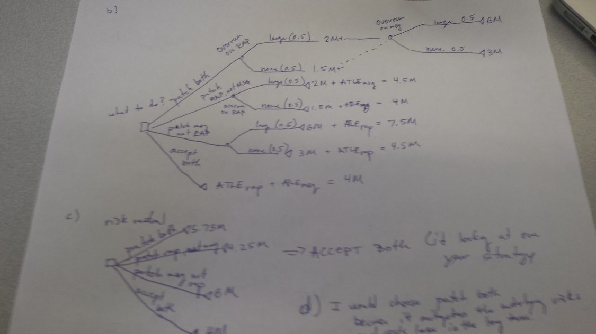
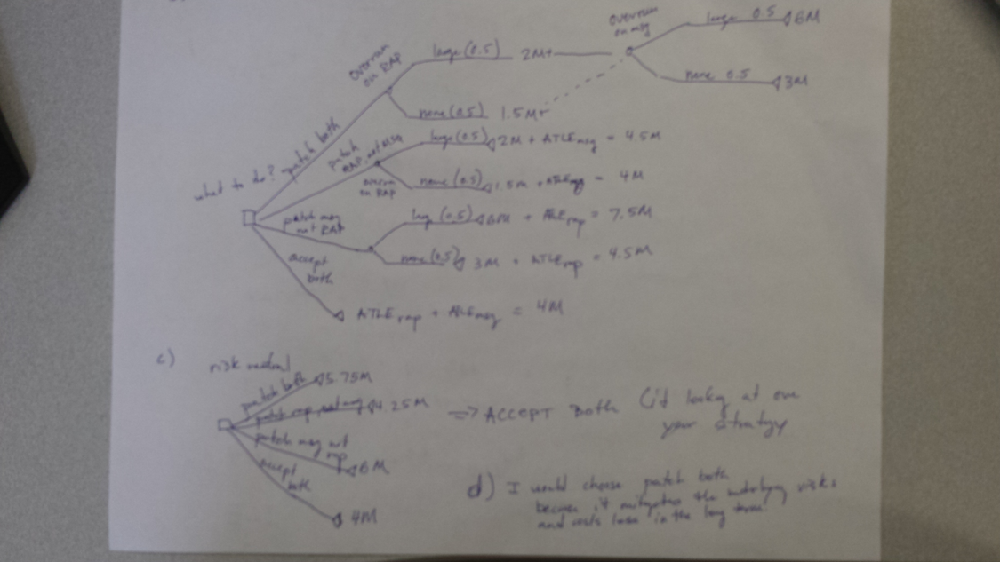

# Extra Practice Solution
a)  
ETIrap = AvgPatients x AvgCostclassA  
ETIrap = 5 x (500*0.5 + 2,000*0.25 + 10,000*0.25)  
ETIrap = 5 x (250 + 250 + 2,500)  
ETIrap = 5 x 3,000 = $15,000 

ATLErap = Freqrap * ETIrap  
ATLErap = (10 * 12) * ($15,000)   
ATLErap = 120 * 15,000 = $1.8M     
(caps out at 1.5M)   
ATLErap = $1.5M  

ETImsg = 125 * (0.2 * 50,000 + 0.8 * 10,000)  
ETImsg = 125 * 18,000 = $2.25M  

ATLEmsg = Freqmsg * ETImsg  
ATLEmsg = ((1/8) * 12) * 2.25M  
ATLEmsg = (3/2) *2.25M = $3.375M   
(caps out at 2.5M)  
ATLEmsg = $2.5M  

b) - d)  
  

